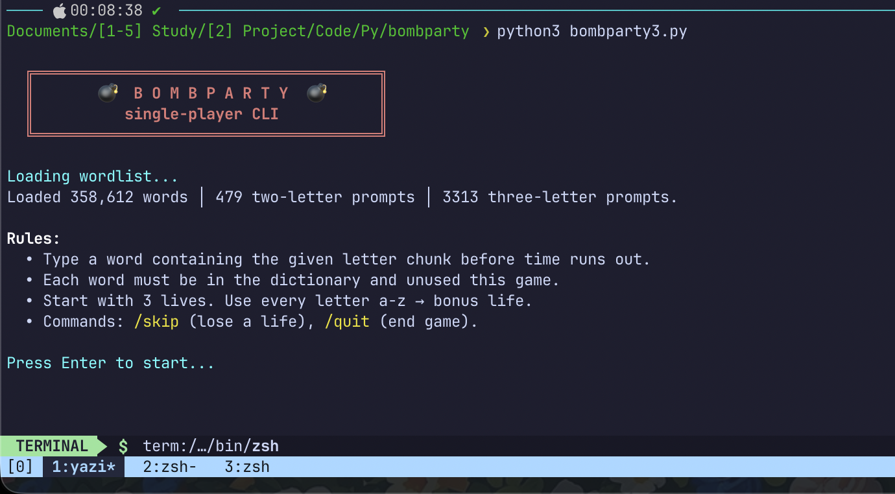
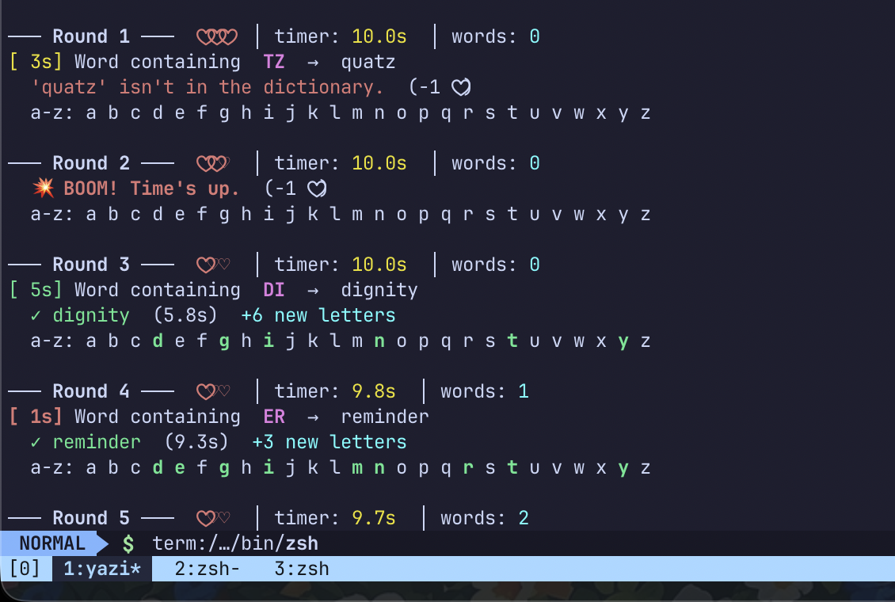
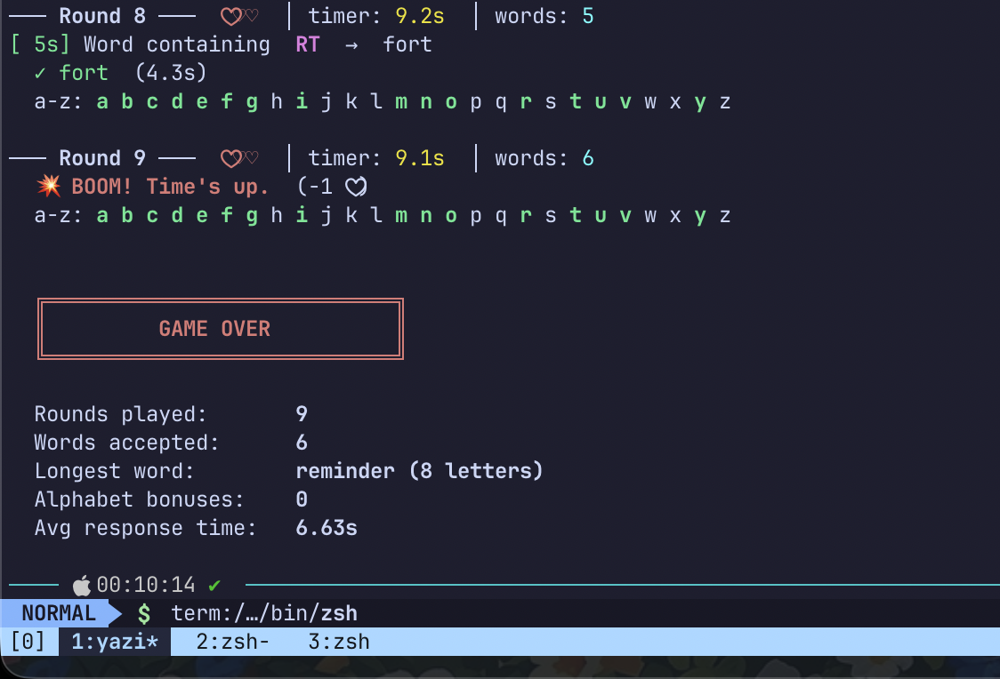

# BombParty CLI

A single-player, terminal version of [jklm.fun](https://jklm.fun/)'s BombParty. Type a word containing the given letter chunk before the bomb explodes.

No browser, no server, no dependencies beyond the Python standard library.

## How it works

- Each round shows a 2–3 letter chunk (e.g. `TR`, `PHO`).
- Type any dictionary word containing that chunk before the timer runs out.
- You start with 3 lives. Wrong, repeated, timed-out, or invalid words cost a life.
- Use every letter of the alphabet across your words to earn a bonus life.
- The timer shrinks after every correct word, so it gets harder as you go.

Word validation is checked against the [dwyl/english-words](https://github.com/dwyl/english-words) list (~370k words), auto-downloaded on first run.

## Requirements

- Python 3.7+
- No pip packages needed — uses only the standard library.

## Usage

```bash
python3 bombparty.py
```

On first run, the wordlist (~4 MB) is downloaded and cached at `~/.bombparty/words_alpha.txt`. Every run after that is instant — nothing is re-downloaded, and nothing needs to be committed to this repo.

If your Python install hits an SSL certificate error on first download (common on macOS), the script automatically falls back to `curl`, then `wget`. If all three fail, it prints the exact manual command to fetch the file yourself.

### In-game commands

| Command  | Effect                     |
|----------|-----------------------------|
| `/skip`  | Skip the round (costs a life) |
| `/quit`  | End the game immediately    |

## Why no wordlist in the repo

`words_alpha.txt` is fetched and cached locally at runtime, not tracked in git (see `.gitignore`). This keeps the repo small and always pulls the source list directly from dwyl/english-words.

## Preview





## License

This project is licensed under the MIT License - see the [LICENSE](LICENSE) file for details.
